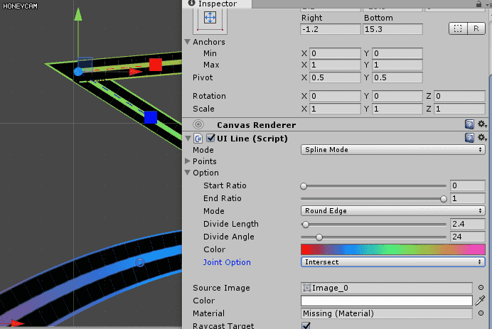
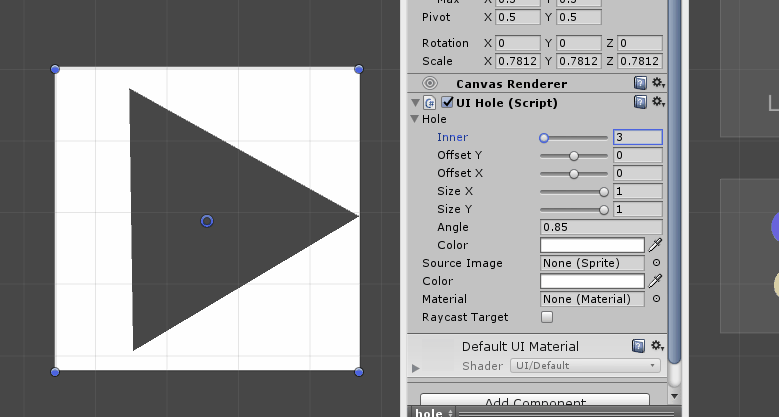

# DataRenderer2D-PatchNote

this is patch node of [it](https://assetstore.unity.com/packages/tools/modeling/spline-mesh-drawer-102377)

-----

1.0.4 

-add joint Option 

-remove normalVector -> all normal vector is Vector(0,0,-1)

-add property drawer of line, lineOption.

-unity version change 2017.1 to 5.6

----

1.0.4.2

-fixed #1

-----
1.0.5
Add input line example.

Adding methods to make it easier to edit in scripts(check exmaple5)

-----
1.0.5.1
Enable to change path of asset.

-----
1.1
rename from SplineMeshDrawer to DataRenderer2D.

add Polygon, SinWave.

Optimazation.(less stack/heap memory, less GC), thought there is many gc. have to control vertex count.

-----
1.2
remove button size setting.

add UIHole.

-----
1.2.1 18-09-06

now, vertex contains tangent info in worldline.
add Button for handle to Copy and paste issue.

------
1.3 2024-07-24 (almost 6 years later..)

1. fix bug

before

after

2. add angle

