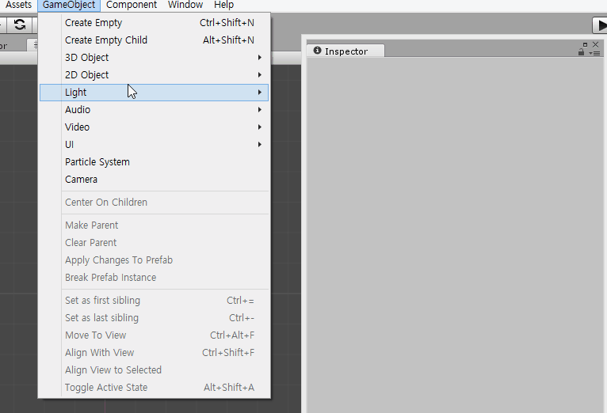
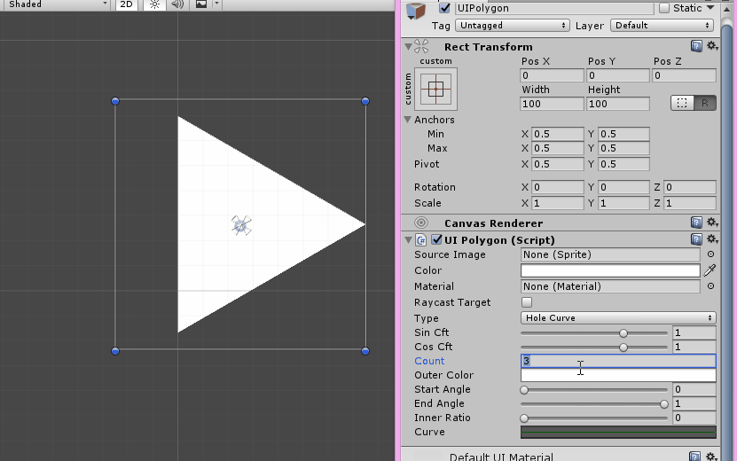
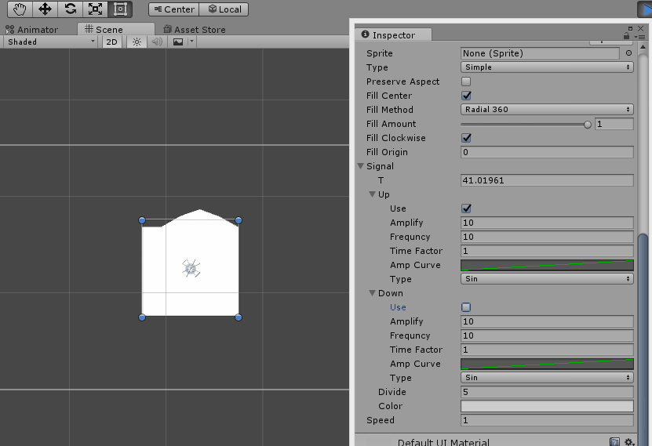
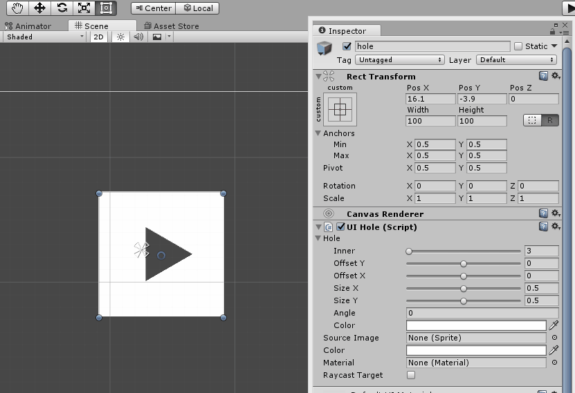

# DataRenderer2D subpage 

[PatchNote](PatchNode.md)

[AssetStore(commercial)](https://assetstore.unity.com/packages/tools/modeling/data-renderer-2d-102377)

[FreeVersion](https://github.com/geniikw/drawLine)
(old version, doesn't optimazed, less utility but function is almost same) 

DataRenderer2D is tool allow you can create mesh base data. you can create line, polygon and sinwave. Also you can  animate these mesh by modify data using Unity3d animator.

* this is not source code repository. only handle guide and patch note. 

## Bezier line
- Each node has control point and width.
- set line drawing rate using start rate and end rate.

## Polygon
- various method to draw polygon.
- count, scale, inner ratio.

## Sinwave

## Hole

